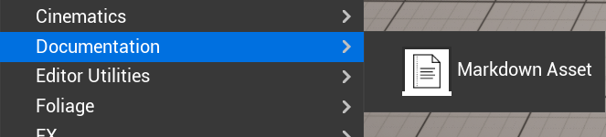
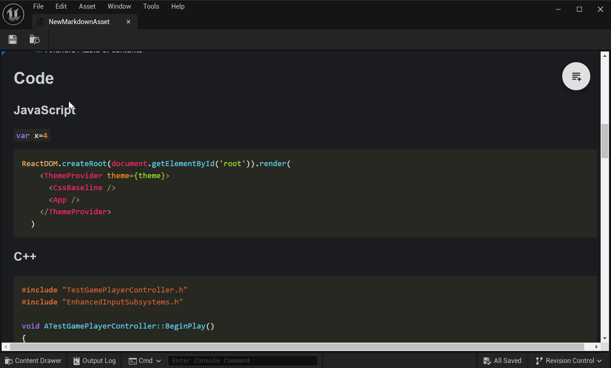
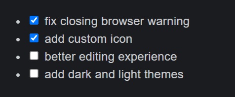
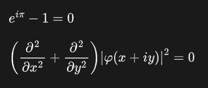
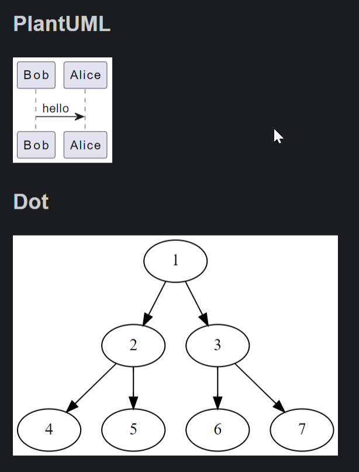

# Markdown Asset

This adds markdown as an asset to the Unreal game engine.

> * Tested on UE 5.3
> * Note this also requires the Web Browser plugin to be enabled.

Behold, the latest game-changing feature in Unreal: Markdown! Why, you ask? Because sometimes, in the wild world of side projects, you need to document your midnight musings right where the magic happens – in the game editor itself! Now, you can scribble notes amid your digital dragons and spaceships. Genius or madness? Jury's still out. Really, I just fancied coding my own asset type for giggles. Any regrets? A smidge. But hey, it's done now. If others find it useful, brilliant! If not, at least my cat appreciates the extra keyboard time.

## How to install

1. Clone this repo into your project's `Plugins` folder.
2. Build your project
3. Enable the Web Browser plugin (`Edit -> Plugins` from the menu)
4. Enable the Markdown Asset plugin (`Edit -> Plugins` from the menu)

## How to use

### Create an asset

* In the content browser
* Right click -> Miscellaneous -> Markdown Asset



### Edit an asset

* Double click the asset to edit
* This will open the asset in the editor
* You can switch between the editor and preview mode using the button in the top right



### Settings

* You can swap between a light and dark skin in the editor preferences
* Edit -> Editor Preferences -> Plugins -> Markdown Asset

## Markdown Extensions

The editor runs inside the unreal web browser client. Under the hood it is using [markdown-it](https://github.com/markdown-it/markdown-it) and I've enabled a bunch of plugins that extend the markdown language with some extra goodies. Here's a quick rundown of what's available.

### Syntax Highlighting

Should be automatic for code blocks. You can specify the language like this:

    ```c++
    #include "TestGamePlayerController.h"
    #include "EnhancedInputSubsystems.h"

    void ATestGamePlayerController::BeginPlay()
    {
        Super::BeginPlay();
    }
    ```

### Tasks Lists

Are added like this:

```markdown
- [x] fix closing browser warning
- [x] add custom icon
- [ ] better editing experience
- [ ] add dark and light themes
```

Which gives this:




### Anchors

Headings are automatically given anchors, so you can link to them like this:

```markdown
[Link](#ignore-extra-cells)

will jump to ...

## Ignore extra cells
```

### Table of Contents

You can automatically add a table of contents to your document like this:

```markdown
[[toc]]
```

### MathJax

You can add math equations with [MathJax](https://www.mathjax.org/) by wrapping them with `$` or `$$`:

#### Inline

```markdown
    $e^{i\pi} - 1 = 0$
```

#### Block

```markdown
    $$
    \left( \frac{\partial^2}{\partial x^2} + \frac{\partial^2}{\partial y^2} \right) {| \varphi(x+ i y)|}^2 = 0
    $$
```

Gives ...




### Diagrams

Diagrams can be added with [GraphViz](https://graphviz.org/Gallery/directed/) (see [markdown-it-textual-uml](https://github.com/manastalukdar/markdown-it-textual-uml) for details).

For example:

    ```plantuml
    Bob -> Alice : hello
    ```

    ```dot
    digraph example1 {
        1 -> 2 -> { 4, 5 };
        1 -> 3 -> { 6, 7 };
    }
    ```

Which gives this:



PlantUML and Dot diagrams work fine. Ditaa and Mermaid, not so much.

### Videos

You can embed videos from YouTube and Vimeo like this:

```markdown
@[youtube](tgbNymZ7vqY)
@[youtube](http://www.youtube.com/embed/tgbNymZ7vqY)
```

## Notes

**NB:** You might not want to ship with your documentation. Make sure the markdown assets are not included in your build, unless you really want to ship with them.

GL & HF

