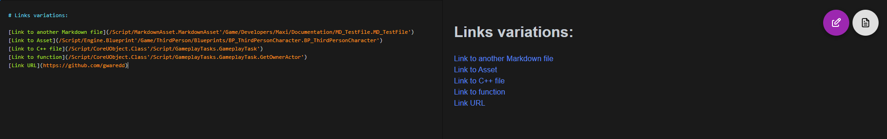
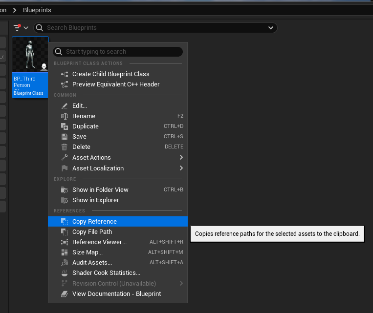
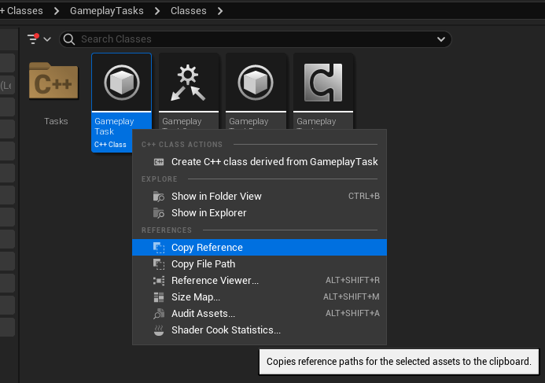
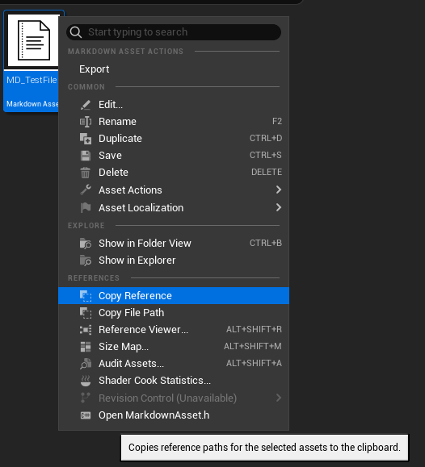

# Markdown Asset

A plugin for the Unreal game engine that adds Markdown as a new asset type.
 
> Unreal tested versions
> * 5.3
> * 5.4
> * 5.5

This allows you to create and manage documentation directly within the engine. This is particularly useful for personal projects and prototyping when you want to keep documentation with the project and close to hand.

## How to install

1. Clone this repo into your project's `Plugins` folder.
2. Build your project
3. Enable the Web Browser plugin (`Edit -> Plugins` from the menu)
4. Enable the Markdown Asset plugin (`Edit -> Plugins` from the menu)

## How to use

### Create an asset

* Right click in the content browser
* `Documentation -> Markdown Asset`


### Edit an asset

* Double click the asset to edit
* This will open the asset in the editor
* You can switch between the editor and preview mode using the button in the top right


### Settings

* You can swap between a light and dark skin in the editor preferences
* Edit -> Editor Preferences -> Plugins -> Markdown Asset

## Unreal Engine Links integration

The plugin uses the UAssetEditorSubsystem from the engine to open any asset from a link to it.

You can add links to your project assets, C++ file or even specific functions of a C++ class.



### How to link anything

You can directly copy and paste a reference to any asset or C++ file from the editor




Because Markdown files are assets too, you can reference them too! very useful to build one big index for your systems documentations



You can specify a function in a class link by adding ".FunctionName" at the end, right before the last "'" character. When clicked, the default IDE will show the class at the specific function.

i.e: to link the GetOwnerActor function inside the GameplayTask class the link is:

```markdown
/Script/CoreUObject.Class'/Script/GameplayTasks.GameplayTask.GetOwnerActor'
```

### Anatomy of a link to an asset

There are two important parts to link something from the engine: should starts with **"/Script"** and the actual link should be between two **'** characters after that.

#### Examples of Valid links:

*/Script/CoreUObject.Class'/Script/GameplayTasks.GameplayTask.GetOwnerActor'*

*/Script '/Game/ThirdPerson/Maps/ThirdPersonMap.ThirdPersonMap'*


## Markdown Extensions

The editor runs inside the unreal web browser client. Under the hood it is using [markdown-it](https://github.com/markdown-it/markdown-it) and I've enabled a bunch of plugins that extend the markdown language with some extra goodies. Here's a quick rundown of what's available.

### Syntax Highlighting

Should be automatic for code blocks. You can specify the language like this:

    ```c++
    #include "TestGamePlayerController.h"
    #include "EnhancedInputSubsystems.h"

    void ATestGamePlayerController::BeginPlay()
    {
        Super::BeginPlay();
    }
    ```

### Tasks Lists

Are added like this:

```markdown
- [x] fix closing browser warning
- [x] add custom icon
- [ ] better editing experience
- [ ] add dark and light themes
```

Which gives this:


### Anchors

Headings are automatically given anchors, so you can link to them like this:

```markdown
[Link](#ignore-extra-cells)

will jump to ...

## Ignore extra cells
```

### Table of Contents

You can automatically add a table of contents to your document like this:

```markdown
[[toc]]
```

### MathJax

You can add math equations with [MathJax](https://www.mathjax.org/) by wrapping them with `$` or `$$`:

#### Inline

```markdown
    $e^{i\pi} - 1 = 0$
```

#### Block

```markdown
    $$
    \left( \frac{\partial^2}{\partial x^2} + \frac{\partial^2}{\partial y^2} \right) {| \varphi(x+ i y)|}^2 = 0
    $$
```

Gives ...


### Diagrams

Diagrams can be added with [GraphViz](https://graphviz.org/Gallery/directed/) (see [markdown-it-textual-uml](https://github.com/manastalukdar/markdown-it-textual-uml) for details).

For example:

    ```plantuml
    Bob -> Alice : hello
    ```

    ```dot
    digraph example1 {
        1 -> 2 -> { 4, 5 };
        1 -> 3 -> { 6, 7 };
    }
    ```

Which gives this:


PlantUML and Dot diagrams work fine. Ditaa and Mermaid, not so much.

### Videos

You can embed videos from YouTube and Vimeo like this:

```markdown
@[youtube](tgbNymZ7vqY)
@[youtube](http://www.youtube.com/embed/tgbNymZ7vqY)
```

